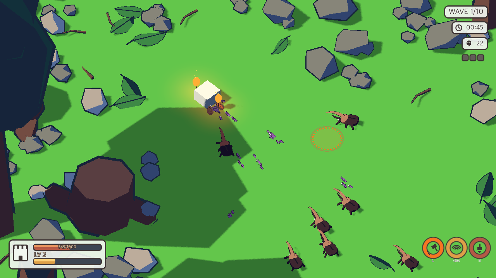
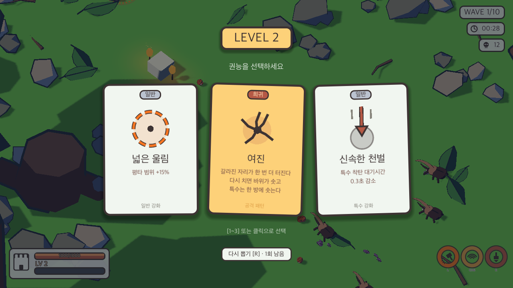

# EXTERMINATE

An isometric low-poly base-defence game built in **Godot 4.7**. Waves of cel-shaded insects march
on your keep; you answer with a hammer, and every level-up hands you three cards to choose from.



## What it is

A single-run roguelite defence game. There is one castle, one hammer, and ten waves. A wave ends
only when every insect it spawned is dead — so the run is as long as you make it, and falling
behind means the next wave starts on top of the last one's leftovers.

The whole run is about 5,300 insects. You are not expected to click each one.

## Status

**Playable prototype, actively being built.** Combat, waves, bosses, the card draft, terrain, and
the art pipeline all work end to end. Balance is provisional and the UI is Korean.

See [Known issues](#known-issues) before your first run.

## Running it

```
git clone https://github.com/junyaung/exterminate.git
```

Open the folder in Godot 4.7 and press **F5**. No build step, no external dependencies — the
exported `.glb` models are committed.

Then press **V** to start the assault. Spawning is off until you ask for it, so you get a quiet
map to look around first — and you can switch it back off at any point to inspect the terrain.

## Controls

| Input | Action |
|---|---|
| **Left click** (tap) | Hammer strike |
| **Left click** (hold, then release) | Charged strike — bigger radius, more damage |
| **Right click** | Special — a vertical drop onto the cursor, on its own cooldown |
| **W A S D** / arrow keys | Pan the camera |
| **Home** | Recentre on the castle |
| **V** | Start / stop enemy spawning |
| **1 – 3** / click | Pick a card during a draft |
| **R** | Reroll the draft (limited uses) |

One click is one attack. Tap for a normal strike, hold past the dead zone and release for a charged
one — you cannot get both from a single press.

<details>
<summary>Developer keys</summary>

| Key | Action |
|---|---|
| `B` | Summon a boss |
| `1` / `2` | Toggle the Aftershock / Fire card effects |
| `4` | Clear the special's cooldown |
| `5`–`9`, `-`, `=` | Toggle individual damage modifiers |
| `O` | Show the eruption hit area |
| `H` | Toggle the cooldown dial |
| `0` | Print a projectile efficiency report |

Cards are drawn at random, so waiting for a specific card to test it is impractical. These are the
way in.
</details>

## Systems

**Waves.** Ten of them, 80 insects rising to 1,300, with bosses arriving on waves 4, 7, and 10.
Spawn rate ramps *within* each wave, and random surges punch extra packs in. Four seconds of quiet
between waves.

**Insects.** Four types, each a real Blender model rather than a placeholder:

| | role | notes |
|---|---|---|
| Ant | grunt | the bulk of every wave |
| Pillbug | runner | curls into a ball and rolls; fast, fragile, reaches the castle first |
| Rhino beetle | heavy | slow, tanky, lifts with its horn |
| Stag beetle | boss | one charge attack, scales up each time it appears |

**Cards.** Seventeen upgrades across normal / charged / special attacks, drawn three at a time on
level-up. Some are stat stacks, some are attack patterns — and holding two specific patterns makes
a third effect fire on its own, without a card for it. A full run currently grants about 19 cards.



**Terrain.** Procedural ground with an in-editor layout tool, scattered props and rocks, torches
that light their surroundings, and a time-of-day tint that shifts the palette as the run goes on.

## Notes on the art

The cel look is not a post-process. Each model carries a two-tone shader that writes `DIFFUSE_LIGHT`
directly, so palette values reach the screen unmodified, and the outline is real geometry — an
inverted hull built with Solidify in Blender and baked into the `.glb`. Body and outline export as
**separate nodes**, because Godot's `cast_shadow` is per-`MeshInstance3D` and a single-node export
lets the hull shadow the model into a black blob.

Two palettes: **nice31** for terrain, castle, and UI; **endesga32** for the insects — the pastel set
has nothing saturated enough to read as cartoon insects, and the two ramps overlap closely enough in
the dark tones that outlines and shadows do not clash.

The full write-up lives in the sibling notes repo as `gamedev/cel_shading_techniques.md`.

## Layout

```
assets/models/   exported .glb (insects, hammer, props)
scenes/          main.tscn, enemy.tscn, boss.tscn
scripts/         gameplay — main.gd is the run loop
shaders/         17 shaders; cel.gdshader and ground_cel.gdshader carry the look
layout/          terrain layout templates
tools/           77 headless verification and simulation scripts
```

`tools/` is worth a look if you are poking at balance. Everything runs headless:

```bash
# how many cards a full run grants, wave by wave
godot --headless --path . --script tools/sim_levels.gd

# compare candidate XP curves without editing anything
XPF=10 XPC=1.35 godot --headless --path . --script tools/sim_levels.gd
```

`tools/shoot.gd` is the exception — it needs a real window, because headless does not render:

```bash
AT=46 PANX=-14 PANZ=-11 OUT=docs/screenshot.png godot --path . --script tools/shoot.gd
```

## Known issues

- Balance is simulated, not play-tested. Nineteen cards per run is a number from `sim_levels.gd`
  under "every insect dies", not from anyone actually finishing a run.
- `tools/verify_levels.gd` reports a false failure — its card-picking loop does not wait for the
  draft delay, so every pick after the first is swallowed.
- All in-game text is Korean.

## Licence

None yet — all rights reserved by default. Open an issue if you want to use any of it.
